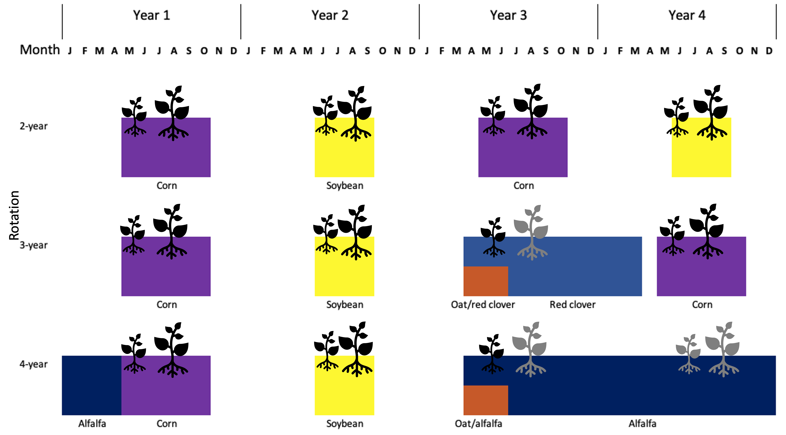

```{r, include=FALSE}
knitr::opts_chunk$set(echo = F, message = F, warning = F,
                      fig.width = 8, fig.height = 8, full.fig.width = T, out.width="100%", fig.pos = "H", table.placement = "H")
#library(tidyverse)
library(kableExtra)
library(emmeans)
library(here)
```

## Experiment Design {-}

Empirical measurements of waterhemp biomass and fecundity were made in 2018 at Iowa State University's Marsden Farm in Boone County, Iowa, USA, (42$^\circ$ 01'N, 93$^\circ$ 47'W, 333 m above sea level). The site description and crop management practices were described by @liebmanWeedSeedbankDiversity2021. 

The experiment was initiated in 2001 on a 9-hectare field to compare the performance of three different crop rotations. In 2008, the experiment was reorganized to allow comparison of two contrasting weed management regimes in each of the three rotation systems. 

In the present study, the experiment comprised of 72 experimental units each 9 m x 84 m. The experimental units (eu) were arranged in a randomized complete block split-plot design with four replications. The experiment was two-way factorial, with crop rotations comprising main plots and weed management regimes comprising split plots. Within each of the four blocks, plots were randomly assigned to one of the crop phases within one of three rotations. In any year, all crop phases within the same rotation were present in different plots in the same replicate block to avoid confounding effects of the year with those of the treatments [@payneDesignAnalysisLong2015]. The 2-year, 3-year, and 4-year crop sequences included in the study are shown in Table \@ref(tab:sequence). The conceptual diagram for the experiment is shown in Figure \@ref(fig:concept).   

Alfalfa in this experiment was sown with oat. Oat was harvested for grain in 2018 and for hay in 2019 and alfalfa was retained over the winter and used as a hay crop the following year. Oat in our experiment was intended for grain harvest but was harvested for hay in 2019 due to high weed infestation and hailstorm damage at oat's critical stage. In the conventional weed management regime, herbicide was broadcast on the whole area that was planted to corn, whereas in the low herbicide regime, herbicide was applied in 38-cm bands over corn rows, and interrow areas were cultivated. Even though corn was the only crop that received the contrasting weed management regimes, all other crops were identified with the weed management applied to the corn phase (hereafter referred to as *corn weed management*), to which they followed. To improve weed control efficacy, herbicides used for soybean differed between 2018 and 2019. Details concerning crop genotypes and management practices are shown in Table \@ref(tab:crop-id).  

```{r crop-id, echo=FALSE}
crops_id <- read.csv("../2 Data/Clean data/crop_mgt.csv", na = ".")

rownames(crops_id) <- NULL

crops_id_clean <- crops_id[-c(1, 9),] 

rownames(crops_id_clean) <- NULL
colnames(crops_id_clean) <- c("Rotation", "Crop", "Hybrid or cultivar", "Planting date", "Harvest date",
                              "Seed density", "Crop density" , "Interrow", "Cultivation", "Herbicide (kg ai/ha)")

#crops_id_clean$`Seed density` <- gsub("seedsm^-2", "seedsm$^{-2}$", crops_id_clean$`Seed density`) #can't fix the squared with gsub


kable(crops_id_clean , booktabs = T,
      caption = "Crop varieties, and dates and rates for management operations in 2018 and 2019. Oat and red clover were intercropped in the 3-year system. Oat and alfalfa were intercropped in the third year of the 4-year system and alfalfa was overwintered after oat harvest.")  %>%
   kable_styling(font_size = 8) %>%
  column_spec(1, width = "4em") %>%
    column_spec(3:4, width = "6em") %>%
  column_spec(c(6,8:9), width = "5em") %>%
    column_spec(c(5,7), width = "8em") %>%
  column_spec(10, width = "15em") %>%
  pack_rows("2018 season", 1,1) %>%
    pack_rows("2019 season", 8,8) %>%
  landscape()
```


```{r sequence, echo=FALSE}
#knitr::include_graphics('./Map2018.png')

seq <- read.csv("../2 Data/Clean data/sequence.csv", na = "")

seq %>% 
  kbl( align = "lccccccccc",
       linesep = "",
       col.names = c("", rep("2-year", 2), rep("3-year", 3), rep("4-year", 4)) ,
       caption = "Crop phases of the three rotation systems present in a replicate block in 2018 and 2019")
```

```{r concept, echo=FALSE, out.width="100%", fig.cap="Conceptual diagram of the three rotation systems compared within the experiment. A cycle of four calendar years is shown. Crops are color-coded and displayed for the approximate months that they were present. Emergence and establishment of common waterhemp plants are illustrated with black symbols. Grey plants shown in oat or alfalfa’s first year were physically controlled by crop harvest operations. Grey plants shown in alfalfa’s second year were physically suppressed three to four times by haynharvest. Alfalfa's hay was harvested when approximately 5% of the plants flowered."}


```

## Sample collection {-}  

Samples for all response variables were collected at least 3m in from the border of each eu to avoid the possible edge effects. 
For each response variable, samples were collected from eight quadrats per eu to account for the patchiness of the weed populations. In 2018, the sex ratio was assessed by scouting the whole eu to obtain higher degrees of freedom. 
The date of sample collection and total sampled area for population- and individual-based measurements are shown in Table \@ref(tab:sample-id).   


```{r, sample-id, echo=FALSE}
sample_id <- read.csv("../2 Data/Clean data/sampling.csv", na = ".")

colnames(sample_id) <- NULL

kable(sample_id, linesep = "", booktabs = T, digits = 1, "latex",
      col.names = c("Measurement", "crop", "collection date", "sampled area (m^2)","collection date", "sampled area (m^2)"),
      caption = "Sampling dates and areas in 2018 and 2019") %>%
   kable_styling(font_size = 8) %>%
  add_header_above(c(" " = 2, "2018" = 2, "2019" = 2), bold = F) %>%
  landscape()

```

### Population sex ratio{-}     

In 2018 we scouted each eu until 100 or all the available plants (if the number of plants available was fewer than 100) were sexed to obtain greater degrees of freedom. We determined the sex of 252, 1999, 2426, and 895 waterhemp plants in alfalfa, oat, soybean, and corn, respectively. In 2019, eight quadrats per eu were marked at the beginning of the season and fixed until crop harvest for a census. Overall, 413, 1331, 0, and 553 waterhemp plants were sexed in alfalfa, oat, soybean, and corn, respectively. Zero observations in all the soybean eu's resulted from high herbicide efficacy, so the 2019 data was imputed (Appendix B).  

#### Population aboveground mass and density     

The quadrats were randomly placed in a 4 x 2 grid at the sampling date and were non-overlapping with the 2019 census quadrats. The number of plants and the total dried biomass was tallied by eu.  

#### Individual female aboveground mass and fecundity     

The maturation of waterhemp seeds can take 20 days from pollination [@bellTimeRequirementPollination2010]. 
We harvested female waterhemp plants as close to crop harvest as possible to maximize the number of mature seeds on mother plants. Prior to sample collection in an eu, the whole area was visually inspected to estimate the difference in plant sizes. Specimens were then collected to best capture the range of within-eu variance. 
Given the time and labor constraints, we planned to collect eight intact plants from each eu, which was equivalent to 576 plants in total. Plants had to be identifiable per @uvaWeedsNortheast1997. By the time the seeds reached maturity, 389 intact plants were collected and processed. No intact plants were collected from two eu's.
Plant specimens were contained individually in tightly knitted fabric bags to prevent seed loss. The detailed procedure for seed cleaning and counting is provided in Appendix A.     


## Model fitting and selection {-}  
Waterhemp survival in soybean was the greatest among all crops in the experiment in 2018 but the least in 2019 because of the use of different herbicide active ingredients. Given year-to-year differences in the sampling scheme and herbicide efficacy, the two years of data were thus analyzed separately for all the response variables in R version 4.1.2 [@rdevelopmentcoreteamLanguageEnvironmentStatistical2021]. The data was curated with the `tidyverse` package  [version 1.3.1, @wickhamTidyverseEasilyInstall2021].

In 2018, 2% of the sex ratio data was missing due to zero observations in one eu, so complete case analysis, in which eu of unknown sex ratio was removed from the data set, was used. In 2019, 22% of the sex ratio data was missing, so the data were imputed with predictive mean matching (PMM) method with the `mice` package [version 3.13.0, @vanbuurenMiceMultivariateImputation2011] to optimally replace missing data with meaningful values without altering the observed sex ratios (Appendix). Any model that involved the imputed data was fitted on all the produced (imputed) data sets, and the results were pooled [@whiteMultipleImputationUsing2011]. 

Block was included in all models as a fixed factor because blocks were used to control the different field conditions across sections, and thus to reduce variance between eu's [@dixonShouldBlocksBe2016]. All the models were first fitted full, with block, corn weed management and crop identity, the interaction of corn weed management and crop identity, and covariates when applicable, then reduced to remove non-significant factors. Crop identity is the combination of crop species and the rotation to which they belonged. The within-eu variation was random and absorbed in the random error term in each model equation. The fitted models were linear (`lm`), generalized linear (`glm`), or generalized least square (`gls`) depending on the data structure and the nature of the response variable. The response and quantitative variables were appropriately transformed as needed to obtain homogeneous variances. Half of the minimum, non-zero value among all the observations was added to all the observations before ln-transformation to replace zeros. Response variables that were all non-zero were ln-transformed without adjustment. The goodness of fit of each model was assessed with diagnosis plots and mean squared error (MSE) of the variance.   

The marginal means of each response variable were estimated with the `emmeans` function from the `emmeans` package [version 1.7.1-1 @lenthEmmeansEstimatedMarginal2021] to accommodate non-integer and unequal degrees of freedom among groups. Marginal means were averaged over blocks for post- ANOVA or ANCOVA contrasts. Degree of freedom adjustment was done with the Satterthwaite method for the `gls` and Kenward-Roger method for the `glm` and `lm` models.  
ANCOVA (analysis of covariance) was applied to examine the effect of treatments on the relationship between female aboveground biomass and fecundity and between population sex ratio and biomass or density at maturity. 
ANCOVA combines regression and ANOVA (analysis of variance) to improve precision in mean estimation as compared to ANOVA estimation [@yangAnalysisCovarianceAgronomy2011].  
Type III sums of squares error were calculated with the `emmeans`'s `joint_tests` function to accommodate unbalanced data with interaction when occurred and to avoid misleading assessment of factors' effects based on their sequential order in the model. 

### Population sex ratio at maturity{-}  

A logistic regression model was fitted with the `glm` command and `family = quasibinomial(link = logit)` argument specification to analyze sex ratio. The `quasibinomial` family with follow-up F-test was used to accommodate overdispersion and `logit` link function transformed the sex ratio using the natural logarithm (ln) [@crawleyProportionData2013].  

$$ S_{ijk} = Binomial\,(N_{ijk},\pi_{ijk}) $$

\begin{align}
ln \frac{\pi_{ijk}}{1-\pi_{ijk}} = \mu + b_k + \alpha_i + \gamma_j +\alpha_i \gamma_j + \epsilon_{ijk} \label{eq:sex-mature}
\end{align}

where,   

$S_{ijk}$ is the number of female plants among all the $N_{ijk}$ plants in block $k^{th}$ under crop identity $i^{th}$ and corn weed management $j^{th}$,  
$ln \frac{\pi_i}{1-\pi_i}$ is the logit transformation of $S_{ijk}$,   
$\mu$ is the overall mean female proportion, the intercept,   
$\alpha_i$ is the effect of the $i^{th}$ crop identity,   
$\gamma_j$ is the effect of the $j^{th}$ corn weed management,   
$b_k$ is the block effect,   
$\alpha_i \gamma_j$ is the interaction effect of crop identity and corn weed management, and   
$\epsilon_{ijk}$ is the random error.  

### Population aboveground mass and density{-}   

A linear regression model was fitted with the `lm` command on each of the two variables, population aboveground mass or stand density. The general model equation for these response variables is  

\begin{align}
Y_{ijk} = \mu + b_k + \alpha_i + \gamma_j +\alpha_i \gamma_j + \epsilon_{ijk} \label{eq:pop-mass-dens}
\end{align}

where,  

$Y_{ijk}$ is either the ln-transformed population aboveground mass or ln-transformed stand density in block $k^{th}$ under crop identity $i^{th}$ and corn weed management $j^{th}$,   
and other terms as defined in Equation \@ref(eq:sex-mature).  

### ANCOVA of population sex ratio, aboveground mass, and density{-}   

The regression of sex ratio against population density or biomass was extended from the ANOVA of sex ratio (Equation \@ref(eq:sex-mature). 

$$ S_{ijk} = Binomial\,(N_{ijk},\pi_{ijk}) $$

\begin{align}
ln \frac{\pi_{ijk}}{1-\pi_{ijk}} = \mu + b_k + \alpha_i + \gamma_j +\alpha_i \gamma_j + \delta D_{ijk}  + \alpha_i D_{ijk} + \gamma_j D_{ijk} + (\alpha_i \gamma_j)D_{ijk} + \epsilon_{ijk} \label{eq:sex-mature-anc}
\end{align}

where,  

$\delta$ is the effect of the covariate,   
$D_{ijk}$ is the natural log-transformed population stand density in block $k^{th}$ under crop identity $i^{th}$, and corn weed management $j^{th}$, the covariate,  
and other terms as defined in Equation \@ref(eq:sex-mature).  


### Individual female aboveground mass and fecundity{-}    

A compound symmetric linear regression model (with `nlme` package's `gls` command was first fitted for each of the response variables, individual aboveground mass and fecundity to accommodate negative variance that occurred when the within-eu variance was larger than the between-eu variance and correlated errors occurred within blocks [version 3.1-153 @pinheroNlmeLinearNonlinear2021]. 
The `corCompSymm` argument in the `gls` command was specified by identifying unique combinations of block and treatment. The model in this exercise is of the same form as the model in Equation \@ref(eq:pop-mass-dens):    

\begin{align}
Y_{ijkl} = \mu + b_k + \alpha_i + \gamma_j +\alpha_i \gamma_j + \epsilon_{ijkl} \label{eq:indiv-mass-fecund}
\end{align}

where,  
$Y_{ijkl}$ is either the ln-transformed aboveground mass or ln-transformed number of seeds of female plant $l^{th}$ in block $k^{th}$ under crop identity $i^{th}$ and corn weed management $j^{th}$,  
$\epsilon_{ijkl}$ is the random error,   
and other terms as defined in Equation \@ref(eq:sex-mature).  

### Individual female aboveground mass and fecundity relationship {-}  

The regression of individual plant fecundity against individual plant aboveground mass was combined from the ANOVA of each (Equation \@ref(eq:indiv-mass-fecund)) to establish a relationship between the two variables:   

\begin{align} 
Y_{ijkl} = \mu + b_k + \alpha_i + \gamma_j +\alpha_i \gamma_j + \beta X_{ijkl} + \alpha_i X_{ijkl} + \gamma_j X_{ijkl} + (\alpha_i \gamma_j)X_{ijkl} + \epsilon_{ijkl} \label{eq:mass-fecund-anc}
\end{align}
where,   

$Y_{ijkl}$ is the number of seeds of plant $l^{th}$ in block $k^{th}$ under crop identity $i^{th}$ and corn weed management $j^{th}$,   
$X_{ijkl}$ is the dried aboveground mass of plant $l^{th}$ in block $k^{th}$ under crop identity $i^{th}$, and corn weed management $j^{th}$, the covariate,  
and other terms as defined in Equation \@ref(eq:sex-mature). 

```{r,include=FALSE}
#<https://learning.oreilly.com/library/view/SAS+for+Linear+Models,+Fourth+Edition,+4th+Edition/9781590470237/xhtml/ch07.xhtml#_Toc133> 
```

We tested the assumption that all the regression lines were parallel. Violation of this assumption required an individual regression line for each treatment. 
To test model robustness, samples in each treatment were pooled across four blocks and divided into four size-based subsets. Samples from each subset were then randomly placed into the testing and training sets using the 80 testing : 20 training ratio. A model was considered to perform well if the data points in the testing set blended well with the data points from the training set, and a relatively small MSE was obtained. A robust model could be used to predict plant fecundity with new biomass data.  

